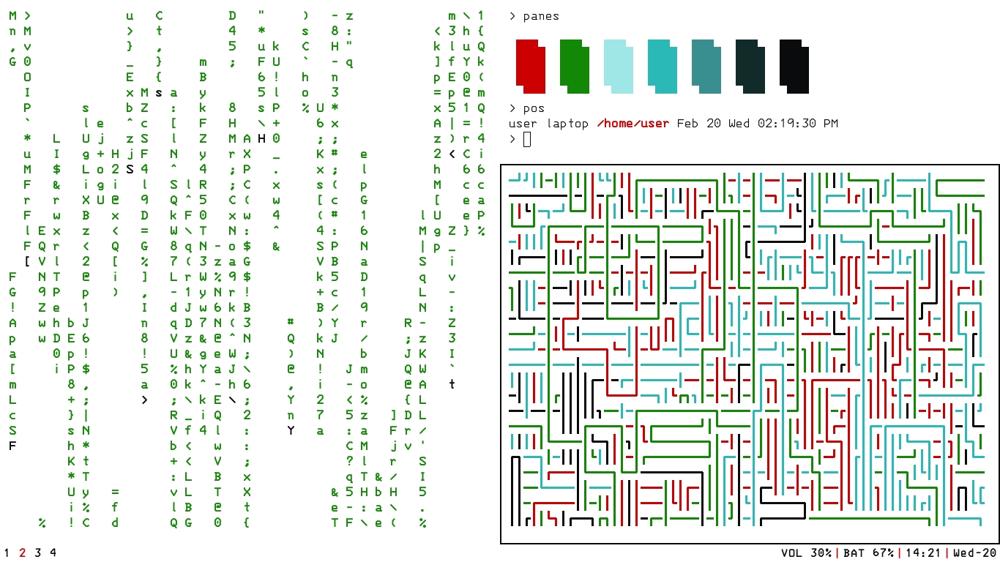

# i3-dotfiles laptop
backup of dotfiles for my laptop

**OS**: [Debian 9](https://www.debian.org/releases/stretch/)

**WM**: [i3wm](https://i3wm.org/)

**FONT**: IBM 3270 ([fonts-3270](https://packages.debian.org/stretch/fonts-3270) in Debian 9)

Inspired by [boubounokefalos](https://github.com/boubounokefalos)'s [post](https://www.reddit.com/r/unixporn/comments/aq76pa/i3_frozen/) ([dotfiles](https://github.com/boubounokefalos/dotfiles_frozen)) (which is based on [vahnrr](https://gitlab.com/vahnrr)'s [post](https://www.reddit.com/r/unixporn/comments/aim9eg/i3gaps_dark_colors_are_comfy/))

## list of apps
- **[URxvt](https://packages.debian.org/stretch/rxvt-unicode)**
- **[vim](https://packages.debian.org/stretch/vim)**
  - using [vim-git-branch-info](https://github.com/taq/vim-git-branch-info) plugin
- **[feh](https://packages.debian.org/stretch/feh)**
- **[cmus](https://packages.debian.org/stretch/cmus)**
- **[scrot](https://packages.debian.org/stretch/scrot)**
- **[i3blocks](https://packages.debian.org/stretch/i3blocks)**
  - [modifications](/usr/share/i3blocks/keyindicator) in [keyindicator](https://github.com/vivien/i3blocks-contrib/tree/master/keyindicator) as the debian package isn't updated to include script supporting user input of colors
  - [modified](/usr/share/i3blocks/battery) [battery](https://github.com/vivien/i3blocks-contrib/tree/master/battery) to give a sleeker output
- **[cmatrix](https://packages.debian.org/stretch/cmatrix)**
- **[fff](https://github.com/dylanaraps/fff)**
- **[pipes.sh](https://github.com/pipeseroni/pipes.sh)**
- **[panes](https://github.com/stark/Color-Scripts/blob/master/color-scripts/panes)** - [Added](/usr/bin/panes) a `$t` at the end because it used to exit with bold text turned on
- **[cli-visualizer](https://github.com/dpayne/cli-visualizer)**
- **[ufetch](https://gitlab.com/jschx/ufetch/tree/master)** - [modified](/usr/bin/ufetch) to o/p i3 instead of /etc/X11/Xsession

## wallpaper

**[Spaceship](http://simpledesktops.com/browse/desktops/2015/may/19/spaceship/)** by [Mario Azzi](http://marioazzi.com/) on [Simple Desktops](https://simpledesktops.com)

## screenshots

**Empty**

**Empty** with bar-2 (toggles on Win+i)

**VIM** - Vim (with vim-git-branch-info plugin), Cmus and Cli-Visualizer

**VIM** Full screen

**Pipes** - Pipes.sh, Cmatrix and  Panes (colorscript)

**Mupdf** - Mupdf (with a sample pdf), Firefox-ESR and URxvt in tabbed mode

**Ufetch** - ufetch, fff file manager, feh with wallpaper
